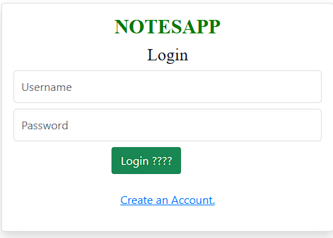
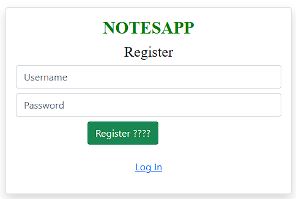
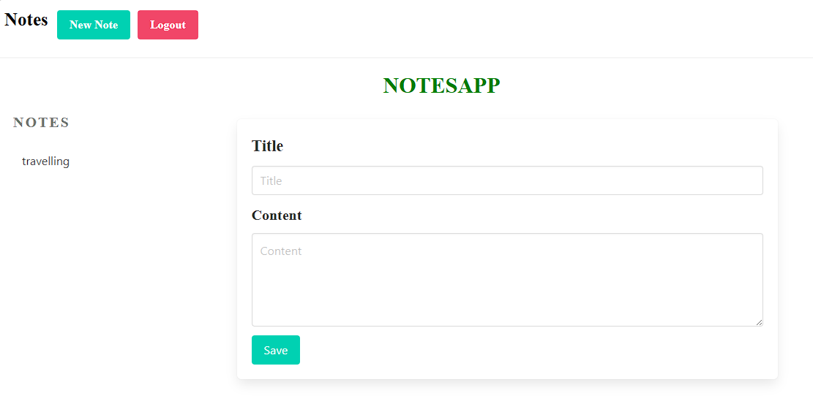
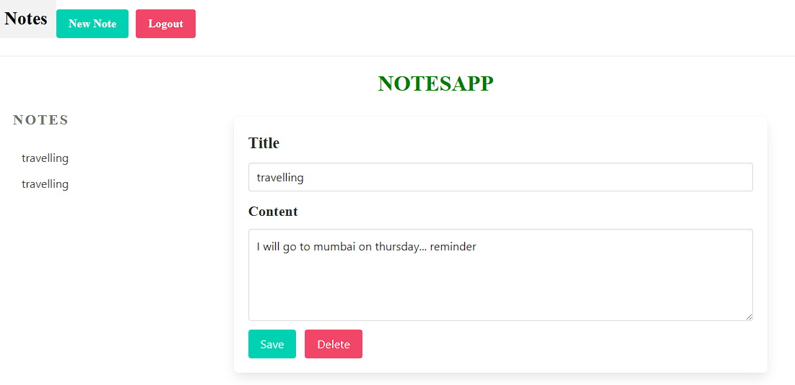

# NotesApp

## Description
NotesApp is a simple application that allows users to manage their notes effectively. It includes functionalities such as user registration, login, note creation, editing, and deletion.

## Login Page
The login page allows users to authenticate by providing their username and password. Below is a screenshot of the login page:

###  Login Page



The login page features:
- A clean and simple UI design.
- Fields for username and password.
- A login button for submitting credentials.
- A link to create a new account if the user does not have one.

## Registration Page
The registration page allows new users to create an account. It includes fields for entering a username, password, and confirming the password. Below is a screenshot of the registration page:

###  Registration Page



The registration page features:
- Fields for username, password, and password confirmation.
- A registration button for submitting the registration form.
- Validation to ensure the provided passwords match.

## Notes Editor
The notes editor page allows users to create, edit, and view their notes. It provides a rich text editor for note content and options to save or delete notes. Below is a screenshot of the notes editor page:

###  Notes Editor



The notes editor page features:
- A text area for writing and editing notes.
- Options to save, edit, or delete notes.
- A list or dashboard to view all saved notes.

## Sample Notes
The sample notes section demonstrates how notes appear in the application. Below is a screenshot showcasing sample notes:

###  Sample Notes



The sample notes section includes:
- Examples of different types of notes.
- Demonstration of note organization and content layout.
- Options to view, edit, or delete individual notes.


## Running the Application

To run the NotesApp locally, follow these steps:

1. **Clone the Repository**:

   ```sh
   git clone https://github.com/BaluChitturi/notesapp1.git
   cd notesapp1
2. **Set Up a Virtual Environment**:
     ```sh
   python -m venv env
3. **Activate the Virtual Environment**:
     ```sh
    .\env\Scripts\activate      ### On Windows
    
     source env/bin/activate    ### On macOS/Linux
4. **.Install the Required Packages**:
   ```sh
   pip install -r requirements.txt
5. **Apply Migrations**:
   ```sh
   python manage.py migrate
6. **Run the Development Server**:
   ```sh
   python manage.py runserver
Visit http://127.0.0.1:8000/ in your web browser to see the application in action.

